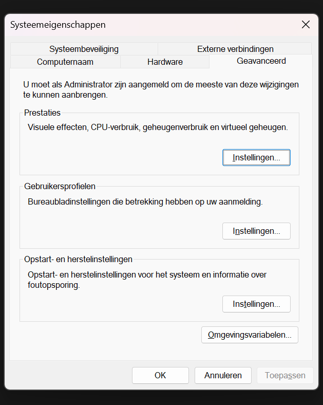

# Readme

---

# Terraform

## Install en verificatie

1. Ga naar volgende link en download de ARM64 windows versie
    
    ```python
    https://developer.hashicorp.com/terraform/install
    ```
    
2. Pak het bestand uit
3. Open “Omgevingsvariabelen”
    
    
    
4. Open de omgevingsvariabelen
    
    
    
5. Klik op de path variabele en voeg een nieuw pad toe
    
    
    
6. Open CMD 
7. Voer volgend commando uit om te kijken of terraform werkt
    
    ```python
    terraform -help
    ```
    

## AWS access met cli

1. Zorg ervoor dat je een AWS account hebt aangemaakt
2. Navigeer naar IAM
3. Maak een nieuwe user aan met een duidelijke naam
4. Vervolgens kies NIET de optie van de IAM
5. Create de user en kies de optie “Direct on user”
6. Zoek “Admin” en voeg vervolgens de AdministratorAccess
7. Create de user
8. Maak een nieuwe user key aan 
    
    
    
9. Sla de gegevens goed op

## AWS CLI

1. Voer volgende stappen uit in CMD of powershell
    
    ```python
    curl "https://awscli.amazonaws.com/awscli-exe-linux-x86_64.zip" -o "awscliv2.zip"
    unzip awscliv2.zip
    ./aws/install
    ```
    
2. Vervolgens log je in op de aws cli
    
    ```jsx
    aws configure
    AWS Access Key ID [None]: "Access key"
    AWS Secret Access Key [None]: "Secret Key"
    Default region name [none]:eu-west-1
    Default output format [None]:
    ```
    

## Download de files

1. Je kan alle documenten overnemen aan de hand van github en git
    
    ```python
    git clone https://github.com/Vic-Winderix/AWS
    ```
    

## Customization

1. Je kan in de [variables.tf](http://variables.tf) de namen, wachtwoorden etc naar keuze aanpassen door de default waarde te veranderen
    
    ```python
    # AWS provider
    variable "aws_region" {
      description = "AWS region"
      type        = string
      default     = "eu-west-1"
    }
    
    # SSH Key
    variable "key_name" {
      description = "Name for the SSH key pair"
      type        = string
      default     = "terraform-key"
    }
    
    # Security Group
    variable "web_sg_name" {
      description = "Name of the web server security group"
      type        = string
      default     = "web-sg"
    }
    
    variable "db_sg_name" {
      description = "Name of the database security group"
      type        = string
      default     = "db-sg"
    }
    
    # S3 Bucket
    variable "s3_bucket_name" {
      description = "Name of the S3 bucket"
      type        = string
      default     = "terraform-vicwin-uploads"
    }
    
    # Database
    variable "db_name" {
      description = "Database name"
      type        = string
      default     = "files"
    }
    
    variable "db_username" {
      description = "Database username"
      type        = string
      default     = "admin"
    }
    
    variable "db_password" {
      description = "Database password"
      type        = string
      default     = "r0998157!"
    }
    
    variable "db_instance_class" {
      description = "Database instance type"
      type        = string
      default     = "db.t3.micro"
    }
    
    # EC2
    variable "ami_id" {
      description = "AMI ID for EC2 instances"
      type        = string
      default     = "ami-0905a3c97561e0b69"
    }
    
    variable "instance_type" {
      description = "EC2 instance type"
      type        = string
      default     = "t3.micro"
    }
    
    ```
    

## Database tabel

1. Je kan de naam van je database tabel aanpassen door in createdb.sql de naam aan te passen
    
    ```python
    CREATE TABLE bestanden (
        id INT AUTO_INCREMENT PRIMARY KEY,
        filename VARCHAR(255) NOT NULL,
        description TEXT,
        created_at TIMESTAMP DEFAULT CURRENT_TIMESTAMP
    );s
    ```